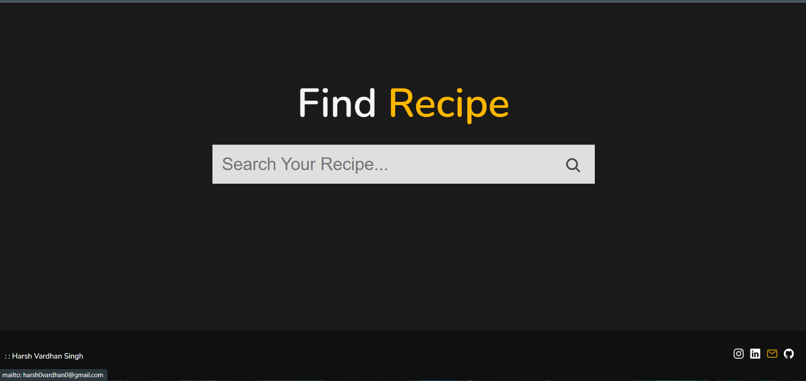
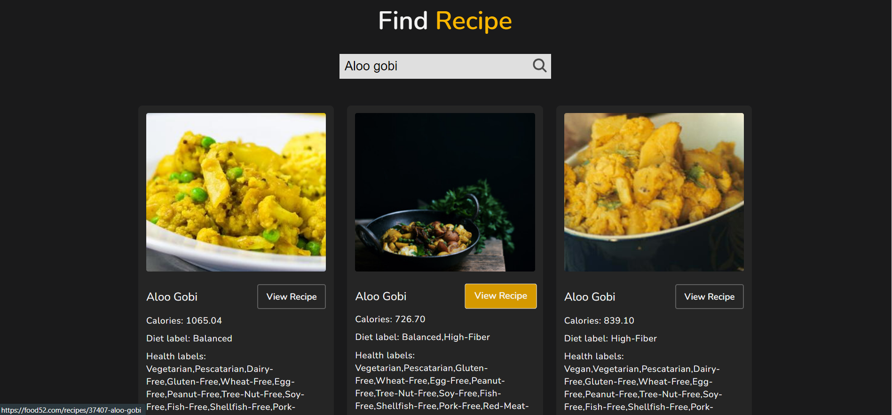

## Overview 👀

- **Easy Search🧐**
- **Desktop first design ✌🏻**
- **Clean UI ⚡**

# About
 - **A simple Web based application that Search over 2.3 million recipes in English using EDAMAM Recipe Search API. 
 - **Created using HTML,CSS for the designing.
 - **Vanilla Javascript is used to fetch and display the different recipes to the users.
 - **Media queries are used to make page responsive .

# LINK
#### https://harshvardhansb.github.io/foodrecipes.github.io/
